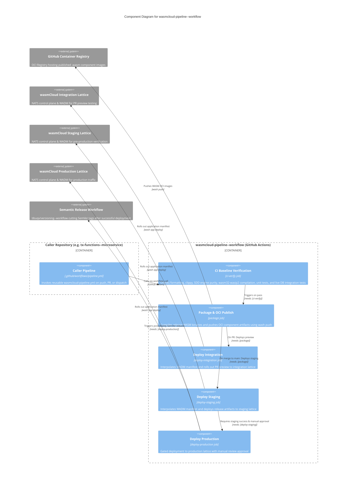

# wasmcloud-pipeline--workflow

Reusable GitHub Actions CI/CD workflow repository orchestrating a **3-stage environment promotion lifecycle** (`integration`, `staging`, `production`) for wasmCloud WebAssembly components and microservices.

This workflow is governed by organizational standards and Architectural Decision Records:
- **ADR-0046**: Standardize on GitHub Flow as the only approved branching model (pure `main` + `feat/*`).
- **ADR-0042**: Adopt wasmCloud as the standard runtime platform for WASM component orchestration.
- **ADR-0043**: Adopt Volatility-Based Decomposition (VBD) for WASM component architecture and enforce SDD contract validation.
- **ADR-0026**: Restrict `.github/workflows` to a single `pipeline.yml` in caller repositories.
- **ADR-0028**: Repository `--workflow` naming suffix policy.
- **ADR-0030**: Canonical software catalog registration in Backstage (`catalog-info.yaml`).
- **ADR-0031**: Post-deployment semantic release and version tagging via `tibuqx/versioning--workflow`.
- **ADR-0034**: Automated fail-closed security and verification baseline gates.
- **ADR-0035**: Mandatory root `README.md` with Mermaid C4 diagram and `AGENTS.md`.

---

## Architecture & Component Flow

The following C4 Component diagram illustrates the execution flow, job dependencies, external systems, and promotion gates:



---

## 3-Stage Promotion Lifecycle (ADR-0046 Compliant)

ADR-0046 establishes **GitHub Flow** as the exclusive branching model across the organization. No `develop`, `release/*`, or `hotfix/*` branches are permitted. All promotion is handled through GitHub Actions execution stages and Environment Protection Rules:

```
[Pull Request: feat/* -> main]
       │
       ▼
 1. CI Baseline Verification
    ├── Code formatting (cargo fmt -- --check)
    ├── SDD contract & engine purity (scripts/validate_sdd.sh)
    ├── Clippy linting (cargo clippy --target wasm32-wasip2)
    ├── WASM compilation (cargo check --target wasm32-wasip2)
    ├── Unit & mock tests (cargo test --lib)
    └── Live DB tests (docker compose + PostgREST integration tests)
       │ (if all checks pass)
       ▼
 2. Integration Preview Deployment
    ├── Package OCI components with pr-<number>-<sha> tag
    ├── Publish to ghcr.io via wash push
    └── Deploy WADM manifest to integration lattice (PR preview)

───────────────────────────────────────────────────────────────────────

[Merge / Push to main]
       │
       ▼
 3. Release Artifact Build & Packaging
    ├── Compile release binaries (cargo build --release --target wasm32-wasip2)
    ├── Tag OCI images with sha-<sha>
    └── Publish to ghcr.io via wash push
       │
       ▼
 4. Staging Deployment (Automated)
    ├── Deploy WADM manifest to staging lattice via wash app deploy
    └── Execute staging health probe and smoke tests
       │
       ▼ (needs: [deploy-staging])
 5. Production Manual Approval Gate
    ├── Gated by GitHub Actions Environment protection rules on 'production'
    ├── Requires explicit human approval from designated reviewers
    └── Zero auto-merge bypass permitted
       │ (upon approval)
       ▼
 6. Production Deployment
    ├── Deploy WADM manifest to production lattice via wash app deploy
    ├── Execute production health check probe
    └── Trigger semantic release (tibuqx/versioning--workflow)
```

### Stage 1: Integration on Pull Request
- **Trigger**: `pull_request` targeting `main`.
- **Gate**: Complete automated CI verification baseline. Any failure fails closed and cancels deployment.
- **Action**: Packages components with tag `pr-${{ github.event.pull_request.number }}-${{ github.sha }}` and deploys them to the `integration` lattice. Allows developers and QA to validate real lattice behavior before merge.

### Stage 2: Staging on Merge to `main`
- **Trigger**: `push` to `main` resulting from an approved, merged Pull Request.
- **Action**: Builds optimized release WASM components (`--release`), publishes OCI images tagged with the commit SHA to GHCR, and rolls out the updated manifest to the `staging` lattice.

### Stage 3: Production Deployment via Manual Gate
- **Trigger**: Sequenced strictly after successful staging deployment (`needs: [deploy-staging]`).
- **Gate**: The `production` environment in GitHub Actions is configured with **Environment Protection Rules**:
  1. **Required Reviewers**: Authorized engineering leads or release managers must explicitly authorize deployment.
  2. **Branch Restrictions**: Restricted strictly to the `main` branch.
- **Action**: Deploys the release manifest to the production wasmCloud lattice and executes health smoke tests.

---

## Inputs, Secrets, and Outputs

### Inputs (`workflow_call.inputs`)

| Name | Type | Default | Description |
|---|---|---|---|
| `rust-version` | `string` | `"stable"` | Rust toolchain version to install. |
| `wasm-target` | `string` | `"wasm32-wasip2"` | Compilation target architecture for WebAssembly components. |
| `enable-sdd-check` | `boolean` | `true` | Whether to run SDD contract and engine purity verification. |
| `sdd-script-path` | `string` | `"scripts/validate_sdd.sh"` | Path to the SDD validation script in the caller repository. |
| `database-compose-file` | `string` | `""` | Path to docker-compose file for test database infrastructure. |
| `database-network` | `string` | `"wasmcloud--infra_default"` | Docker network name for the database test bridge. |
| `database-health-url` | `string` | `"http://127.0.0.1:3001/"` | Readiness probe URL for the live test database. |
| `integration-test-command` | `string` | `""` | Custom shell command for executing database integration tests. |
| `wadm-manifest-path` | `string` | `"deploy/wadm.yaml"` | Path to the WADM OAM application deployment manifest. |
| `oci-registry` | `string` | `"ghcr.io"` | OCI container registry host for WASM component artifacts. |
| `oci-repository-prefix` | `string` | `""` | Repository namespace prefix (defaults to caller `github.repository`). |
| `deploy-integration` | `boolean` | `true` | Enable integration environment deployment on PR. |
| `deploy-staging` | `boolean` | `true` | Enable staging environment deployment on merge to `main`. |
| `deploy-production` | `boolean` | `true` | Enable production environment deployment with manual approval. |
| `integration-lattice` | `string` | `"integration"` | wasmCloud lattice name for integration environment. |
| `staging-lattice` | `string` | `"staging"` | wasmCloud lattice name for staging environment. |
| `production-lattice` | `string` | `"production"` | wasmCloud lattice name for production environment. |
| `health-check-endpoint` | `string` | `""` | Default health check endpoint URL for deployed application. |
| `health-endpoint-integration` | `string` | `""` | Health check URL for integration environment. |
| `health-endpoint-staging` | `string` | `""` | Health check URL for staging environment. |
| `health-endpoint-production` | `string` | `""` | Health check URL for production environment. |

### Secrets (`workflow_call.secrets`)

| Name | Required | Description |
|---|---|---|
| `WASMCLOUD_CTL_HOST` | No | Target wasmCloud lattice NATS control host (isolated per environment). |
| `WASMCLOUD_CTL_PORT` | No | Target wasmCloud lattice NATS control port (default: 4222). |
| `WASH_CTL_CREDS` | No | NATS user credentials or JWT file content for wash control operations. |
| `OCI_REGISTRY_USER` | No | Username for OCI registry authentication (defaults to `github.actor`). |
| `OCI_REGISTRY_PASSWORD` | No | Password / token for OCI registry (defaults to `secrets.GITHUB_TOKEN`). |
| `RELEASE_TOKEN` | No | GitHub write token for post-deployment release tagging. |

### Outputs (`workflow_call.outputs`)

| Name | Description | Source |
|---|---|---|
| `image-tag` | The OCI image tag published during this run (`pr-<num>-<sha>` or `sha-<sha>`). | `jobs.package.outputs.image-tag` |
| `integration-url` | Health/endpoint URL for the integration deployment. | `jobs.deploy-integration.outputs.url` |
| `staging-url` | Health/endpoint URL for the staging deployment. | `jobs.deploy-staging.outputs.url` |
| `production-url` | Health/endpoint URL for the production deployment. | `jobs.deploy-production.outputs.url` |

---

## Caller Usage Example

In accordance with **ADR-0026** (Single Pipeline Rule), caller repositories (such as `tx-functions--microservice`) include a single `.github/workflows/pipeline.yml` invoking this workflow:

```yaml
name: CI/CD Pipeline

on:
  push:
    branches: [main]
  pull_request:
    branches: [main]
  workflow_dispatch:

permissions:
  contents: read
  packages: write
  id-token: write

concurrency:
  group: ${{ github.workflow }}-${{ github.ref }}
  cancel-in-progress: ${{ github.event_name == 'pull_request' }}

jobs:
  wasmcloud-pipeline:
    name: wasmCloud CI/CD Lifecycle
    uses: tibuqx/wasmcloud-pipeline--workflow/.github/workflows/wasmcloud-pipeline.yml@v1
    with:
      rust-version: "stable"
      wasm-target: "wasm32-wasip2"
      enable-sdd-check: true
      sdd-script-path: "scripts/validate_sdd.sh"
      database-compose-file: "deploy/docker-compose.db.yml"
      database-network: "wasmcloud--infra_default"
      database-health-url: "http://127.0.0.1:3001/"
      integration-test-command: "REQUIRE_POSTGREST=true POSTGREST_URL=http://127.0.0.1:3001 cargo test -p user-data-accessor --test postgrest_integration_tests && REQUIRE_POSTGREST=true POSTGREST_URL=http://127.0.0.1:3001 cargo test -p property-data-accessor --test catalog_postgrest_integration_tests"
      wadm-manifest-path: "deploy/wadm.yaml"
      oci-registry: "ghcr.io"
      health-endpoint-staging: "https://staging-api.tibuqx.com/health"
      health-endpoint-production: "https://api.tibuqx.com/health"
    secrets: inherit

  release:
    name: Semantic Version & Release Tag
    needs: [wasmcloud-pipeline]
    if: github.event_name == 'push' && github.ref == 'refs/heads/main'
    permissions:
      contents: write
    uses: tibuqx/versioning--workflow/.github/workflows/release.yml@1.0.0
    secrets:
      token: ${{ secrets.RELEASE_TOKEN }}
```

---

## Local Verification & Development

To validate workflow syntax and expression safety locally:

```powershell
# Using actionlint
& "C:\Users\Luis Manuel\go\bin\actionlint.exe" .github/workflows/*.yml
```

The repository includes `.github/workflows/actionlint.yml` to automatically verify workflows on every push and Pull Request via `raven-actions/actionlint@v2`.
